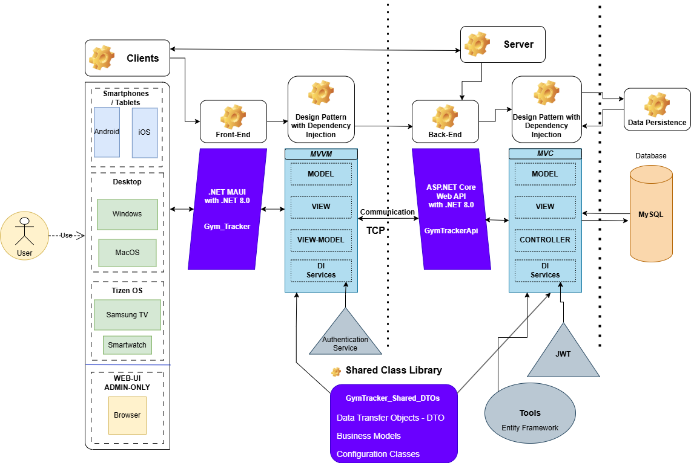

# Gym Tracker App

**Gym Tracker App** is a cross-platform application that enables users to log, view, and create gym training sessions. The project uses a .NET MAUI frontend, an ASP.NET Web API backend, and a shared Class Library (for models and DTOs) to maintain consistency across the solution. The whole project was written with **.NET 8.0.** what is going to be supported until *10th of November, 2026*.

**The project has been created for a C# Developer Course exam.** 

---

## Features

- **User Authentication**  
  Users can register, log in, and receive a JWT bearer token for secure API access.

- **View Trainings**  
  Once logged in, users can view a list of their training sessions, sorted with the newest on top.

- **Training Details**  
  Double-tap a training entry to view detailed information and exercise breakdowns in a modal page.

- **Create Training**  
  Users can create new training sessions by adding multiple exercises, with each exercise having sets, repetitions, weight, and duration.

- **Dynamic Exercise List**  
  The list of available exercises is fetched dynamically from the backend, ensuring that the app always displays current data.

---

## Architecture

The solution is composed of three projects:

1. **Frontend (Gym_Tracker)**  
   - Built using .NET MAUI
   - Implements the MVVM (Model-View-ViewModel) pattern with CommunityToolkit.MVVM
   - Provides the UI and navigation logic for the mobile/desktop application
   - Allows almost every platform to run the application

2. **Backend (GymTrackerApi)**  
   - ASP.NET Web API that handles authentication, training creation, and data retrieval  
   - Uses Entity Framework Core for data access
   - Uses a nuget Package, called Pomelo, that allows the business model creation with simple command line snippets

3. **Shared Library (GymTracker_Shared_DTOs)**  
   - Contains models, DTOs, and configuration classes shared between the frontend and the backend to apply the SOLID Principles

### Visual Architecture Diagram



---

## Prerequisites

- [.NET 8.0 SDK](https://dotnet.microsoft.com/en-us/download/dotnet/8.0) - available download from the link
- [Visual Studio 2022](https://visualstudio.microsoft.com/) (or later)
  - With MAUI and ASP.NET workloads installed
- [Microsoft OpenJDK 17](https://learn.microsoft.com/en-gb/java/openjdk/download#openjdk-17)
- If you want to test the code/application on a virtual/physical smartphone you will need some extra configuration as well - [HowTo](https://learn.microsoft.com/en-us/dotnet/maui/android/device/setup?view=net-maui-8.0)
- A valid SSL certificate for local development (certificate validation is bypassed during development)
- Git (optional)

---

## Getting Started

### Clone the Repository

- git clone ```https://github.com/yourusername/GymTrackerApp.git```
- cd GymTrackerApp

### Setup the Backend
- Open the solution in Visual Studio
- Update the connnection string in **appsettings.json** (if needed)
- Run Entity Framework migrations to set up the database:
```
dotnet ef database update --project GymTrackerApi
```
- Run the ASP.NET Web API project.

### Setup the Frontend

- Open the MAUI project (Gym_Tracker) in Visual Studio
- Ensure the Base API URL is set correctly in the shared configuration (GymTracker_Shared_DTOs and in the Frontend AuthService Class) and in the **appsettings.json** as well
```
public static class AppConfig
{
    public static string BaseApiUrl { get; set; } = "https://192.168.0.67:7013/";
}

public class AuthService : IAuthService
{
  private const string BaseUrl = "https://192.168.0.67:7013/api/auth/";
}
```
- Build and run the project on your chosen platform (Android, iOS, Windows, or Mac).

## Possible Future Improvements

- **Offline Support**: Cache training and exercise data for offline access.
- **Enhanced Validation**: Improve input validation logic
- **Additional Features**: Implement personal training plans, progress tracking in a package of the Premium Subscription
- **Localization and Theming**: Support multiple languages and user-preferred themes.